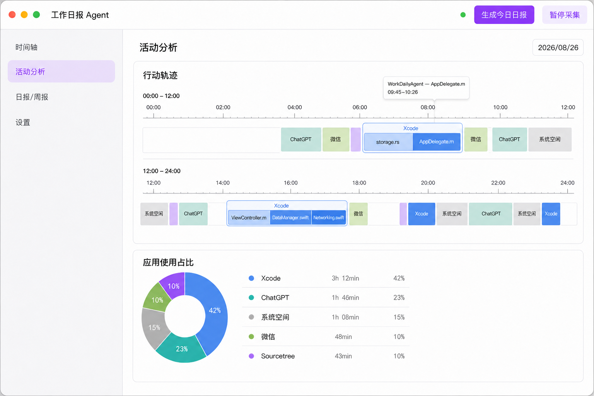

# 活动分析页面 PRD

## 1. 需求目标

新增“活动分析”页面，按天展示用户的行动轨迹和各应用使用时长占比，并支持按日期筛选。

该页面为独立新页面，不修改现有“时间轴”和“日报/周报”页面。页面风格与现有功能保持一致，并保持简洁，不增加其他模块。

## 2. 页面结构

页面包含以下内容：

1. 日期筛选
2. 行动轨迹
3. 应用使用占比

## 3. 日期筛选

- 页面提供日期选择器，以天为筛选维度。
- 切换日期后，行动轨迹和应用使用占比同步更新为所选日期的数据。
- 每次只展示一个自然日的数据。

## 4. 行动轨迹

### 4.1 时间轴

- 展示所选日期 `00:00–24:00` 的行动轨迹。
- 时间轴分为 `00:00–12:00` 和 `12:00–24:00` 两行展示。
- 事件色块的水平位置由实际开始时间决定，宽度由实际持续时长决定。
- 同一时间只能存在一个应用轨迹块，不同应用的色块不得在时间上重叠。
- 跨越 `12:00` 的事件分别显示在上、下两行时间轴中，各段位置和宽度按拆分后的时间计算。

### 4.2 应用合并与标题分段

- 不提供多种轨迹展示模式，不使用 Tab 切换。
- 时间上相邻且应用相同的记录合并为一个应用轨迹块。
- 应用轨迹块只显示应用名，不在应用名后显示起止时间。
- 合并后的应用轨迹块内，不同窗口标题按各自的实际起止时间显示为独立内部色块。
- 同一应用的不同窗口标题使用可区分的同色系色块。
- 内部色块的位置和宽度与对应窗口标题的实际时间保持一致。

### 4.3 文本与悬浮交互

- 窗口标题只显示一行，超出色块宽度时截断。
- 色块宽度不足以展示文本时，只显示色块，不强行展示应用名或窗口标题。
- 合并后的应用轨迹块因宽度不足而隐藏应用名时，内部窗口标题色块占满外层轨迹块高度，不保留空白标题区。
- 鼠标悬浮在应用轨迹块或内部标题色块上时，显示完整的应用名、窗口标题、起止时间和持续时长。

### 4.4 短时应用轨迹过滤

- 相邻的同应用记录合并后，持续时间小于 30 秒的应用轨迹块不在行动轨迹中展示。
- 30 秒过滤仅影响行动轨迹的展示，不影响应用使用时长和占比统计。
- 被过滤事件前后的轨迹块不跨该事件合并，过滤后的时间位置保持空白。
- 过滤判断针对合并后的外层应用轨迹块，不单独过滤轨迹块内的窗口标题分段。

## 5. 应用使用占比

- 按应用聚合所选日期内的使用时长。
- 占比分母为当天所有已记录时长，系统空闲时长也计入分母，并作为独立项参与占比。
- 应用使用时长和占比使用过滤前的完整事件数据计算。
- 使用环形图展示各应用使用时长占比。
- 环形图旁以列表展示应用颜色、应用名、使用时长和占比。
- 每个应用项支持独立展开和收起。展开后按持续时长从高到低展示该应用的事件明细，包含窗口标题、起止时间和持续时长；时长相同时按开始时间升序排列。
- 页面中展示的应用占比百分比保留两位小数。
- 环形图、列表颜色和数值保持一致。
- 应用列表不展示额外的横向进度条。

## 6. 验收标准

1. 能按日期查看行动轨迹和应用使用占比，两个区域的数据日期一致。
2. 轨迹色块的位置和宽度能正确反映事件的实际起止时间，不同应用不发生时间重叠。
3. 相邻的同应用记录正确合并，其中不同窗口标题按实际时间分段展示。
4. 合并后小于 30 秒的应用轨迹块不展示，其前后轨迹块不跨过该事件合并。
5. 达到展示阈值但宽度不足的色块只显示颜色，标题过长时单行截断，悬浮后可查看完整详情；聚合块隐藏应用名时，子色块高度与父色块一致。
6. 应用使用时长聚合正确，占比以过滤前的全部已记录时长为分母，并包含系统空闲时长。
7. 应用列表中的每个应用可独立展开和收起明细，明细内容与原始事件一致，百分比统一保留两位小数。
8. 页面与现有界面风格一致，不增加本 PRD 之外的展示模块。

## 7. 效果图

